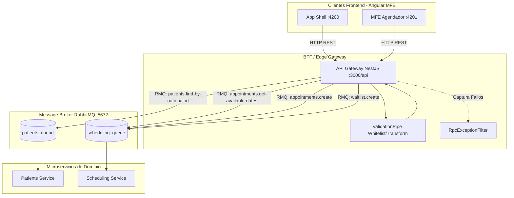

# API Gateway

> **Ficha Técnica del Módulo**  
> * **Ubicación en Monorepo:** `services/api-gateway`  
> * **Tipo de Módulo:** Microservicio NestJS (API Gateway HTTP & Reverse Proxy RMQ)  
> * **Tags Nx (`project.json`):** `["scope:backend", "type:service"]`  
> * **Estado:** Activo  

---

## 1. Propósito y Alcance de Negocio

El **API Gateway** es el punto único de entrada HTTP (BFF / Edge Service) para todo el ecosistema de microservicios del monorepo. Su responsabilidad primordial es desacoplar el frontend (App Shell y Remotes MFE en Angular) de la topología interna del backend, centralizando la validación de peticiones entrantes, la negociación de políticas CORS, la traducción de excepciones y el enrutamiento asíncrono hacia los microservicios de dominio mediante RabbitMQ.

Este componente garantiza que ningún cliente externo tenga acceso directo a las colas de mensajería internas de RabbitMQ, encapsulando la seguridad perimetral, la transformación de datos y la normalización de códigos de estado HTTP ante fallos de RPC.

---

## 2. Diagrama de Arquitectura y Flujo de Información



---

## 3. Contratos de Datos e Interfaces

El API Gateway consume directamente los contratos TypeScript de `@nx-boilerplate/api-interfaces` y aplica validación en tiempo de ejecución utilizando los DTOs de `@nx-boilerplate/shared-dtos`.

### A. Interfaces de Contrato (`@nx-boilerplate/api-interfaces`)

| Interfaz | Archivo Origen | Propósito |
|---|---|---|
| `IPatientHistory` | `libs/shared/api-interfaces/src/lib/patient.interface.ts` | Historial médico consolidado del paciente y sus procedimientos anteriores. |
| `IAvailableDate` | `libs/shared/api-interfaces/src/lib/appointment.interface.ts` | Fechas y horarios disponibles para citas médicas con su respectivo profesional. |
| `ICreateAppointmentRequest` | `libs/shared/api-interfaces/src/lib/appointment.interface.ts` | Estructura canónica del payload para agendar una nueva cita. |
| `ICreateWaitlistRequest` | `libs/shared/api-interfaces/src/lib/appointment.interface.ts` | Estructura canónica del payload para inscripción en lista de espera. |

### B. DTOs y Validación Runtime (`@nx-boilerplate/shared-dtos`)

Todas las solicitudes entrantes son procesadas por un `ValidationPipe` global configurado con `{ whitelist: true, forbidNonWhitelisted: true, transform: true }`.

| DTO | Decoradores / Reglas | Propósito |
|---|---|---|
| `FindPatientByNationalIdDto` | `@IsString()`, `@IsNotEmpty()`, `@Length(5, 20)`, `@Matches(/^[a-zA-Z0-9]+$/)` | Valida el parámetro de ruta `:nationalId` para búsqueda de pacientes. |
| `GetAvailableDatesQueryDto` | `@IsString()`, `@IsOptional()` | Valida los parámetros de consulta (`?procedureId=...`) para disponibilidad de fechas. |
| `CreateAppointmentDto` | `@IsString()`, `@IsNotEmpty()`, `@Matches(/^[0-9]+$/)` (cédula), `@IsEmail()`, `@IsBoolean()`, `@IsOptional()` | Valida el cuerpo de la petición (`POST /api/appointments`) para agendamiento de citas. |
| `CreateWaitlistDto` | `@IsString()`, `@IsNotEmpty()`, `@Matches(/^[0-9]+$/)` (cédula), `@IsEmail()`, `@IsString()` (celular, procedimiento) | Valida el cuerpo de la petición (`POST /api/appointments/waitlist`) para lista de espera. |

---

## 4. Puntos de Entrada y Comunicación

El microservicio expone un servidor HTTP con prefijo global `/api` en el puerto `process.env.PORT || 3000` y habilita CORS para orígenes autorizados (`http://localhost:4200`, `http://localhost:4201`).

### A. Endpoints HTTP Expuestos

#### 1. Salud del Servicio (`HealthController`)
* **GET `/api/health`**
  * **Respuesta (200 OK):**
    ```json
    {
      "status": "ok",
      "service": "api-gateway",
      "timestamp": "2026-09-16T20:30:00.000Z",
      "uptime": 124.5
    }
    ```

#### 2. Gestión de Pacientes (`PatientsController`)
* **GET `/api/patients/:nationalId`**
  * **Parámetros:** `nationalId` (validado mediante `FindPatientByNationalIdDto`).
  * **Transporte Backend:** Envío RPC hacia `PATIENTS_SERVICE` (`patients_queue`).
  * **Patrón RMQ emitido:** `patients.find-by-national-id`.
  * **Payload emitido:** `{ nationalId: params.nationalId }`.
  * **Respuesta esperada:** `IPatientHistory` (200 OK).

#### 3. Agendamiento de Citas (`AppointmentsController`)
* **GET `/api/appointments/available-dates`**
  * **Query Params:** `procedureId?: string` (validado con `GetAvailableDatesQueryDto`).
  * **Transporte Backend:** Envío RPC hacia `SCHEDULING_SERVICE` (`scheduling_queue`).
  * **Patrón RMQ emitido:** `appointments.get-available-dates`.
  * **Respuesta esperada:** `IAvailableDate[]` (200 OK).

* **POST `/api/appointments`**
  * **Body:** `CreateAppointmentDto`.
  * **Transporte Backend:** Envío RPC hacia `SCHEDULING_SERVICE` (`scheduling_queue`).
  * **Patrón RMQ emitido:** `appointments.create`.
  * **Respuesta esperada:** Resultado de la creación de la cita (201 Created).

* **POST `/api/appointments/waitlist`**
  * **Body:** `CreateWaitlistDto`.
  * **Transporte Backend:** Envío RPC hacia `SCHEDULING_SERVICE` (`scheduling_queue`).
  * **Patrón RMQ emitido:** `waitlist.create`.
  * **Respuesta esperada:** Confirmación de registro en lista de espera (201 Created).

### B. Manejo de Errores y Excepciones (`RpcExceptionFilter`)

El filtro global `RpcExceptionFilter` intercepta cualquier excepción proveniente de los clientes `ClientProxy` (mensajes de error RPC, `RpcException` o caídas del broker) y las transforma en una respuesta HTTP normalizada:

```json
{
  "statusCode": 404,
  "message": "Paciente no encontrado con el documento proporcionado",
  "timestamp": "2026-09-16T20:30:00.000Z",
  "path": "/api/patients/12345678"
}
```

---

## 5. Dependencias y Límites Arquitectónicos

De acuerdo con las directrices de `enforce-module-boundaries` de Nx:

* **Tags de Nx:** `["scope:backend", "type:service"]`.
* **Módulos que consume:**
  * `@nx-boilerplate/api-interfaces` (`libs/shared/api-interfaces`): Contratos e interfaces TypeScript puras.
  * `@nx-boilerplate/shared-dtos` (`libs/shared/dtos`): Clases DTO para runtime validation con `class-validator`.
  * `@nestjs/microservices`: Clientes RabbitMQ (`ClientProxy`, `Transport.RMQ`).
* **Dependencias de Red e Infraestructura:**
  * Servidor RabbitMQ (`amqp://localhost:5672` o `process.env.RABBITMQ_URI`).
  * Colas: `patients_queue` y `scheduling_queue`.
* **Módulos que lo consumen:**
  * Aplicaciones cliente Frontend (`app-shell`, `apps/agendador-citas`, `apps/login`) a través de llamadas HTTP REST (`/api/*`).

---

## 6. Guía de Configuración y Variables de Entorno

El servicio utiliza las siguientes variables de entorno para su inicialización:

| Variable | Valor por Defecto | Descripción |
|---|---|---|
| `PORT` | `3000` | Puerto en el que escucha el servidor HTTP Fastify/Express. |
| `RABBITMQ_URI` | `amqp://localhost:5672` | URI de conexión al broker RabbitMQ. |
| `PATIENTS_QUEUE` | `patients_queue` | Nombre de la cola de RabbitMQ para el microservicio de pacientes. |
| `SCHEDULING_QUEUE` | `scheduling_queue` | Nombre de la cola de RabbitMQ para el microservicio de agendamiento. |

---

## 7. Comandos de Verificación (Nx)

Ejecuta los siguientes comandos desde la raíz del monorepo:

```bash
# Servir en modo desarrollo (watch)
npx nx serve api-gateway

# Compilar para producción (Webpack)
npx nx build api-gateway

# Validar reglas de estilo y límites arquitectónicos (Lint)
npx nx lint api-gateway
```
