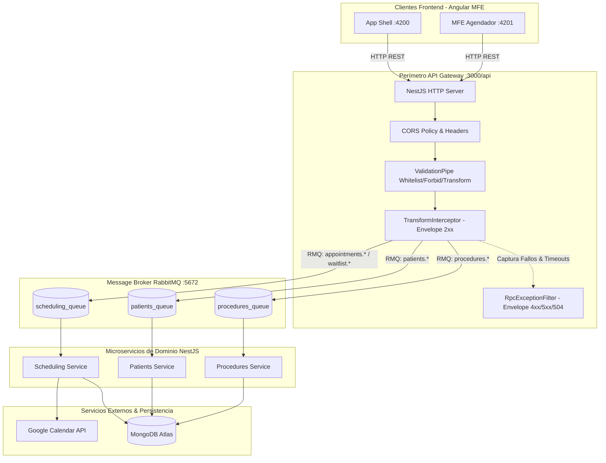

# API Gateway

> **Ficha Técnica del Módulo**  
> * **Ubicación en Monorepo:** `services/api-gateway`  
> * **Tipo de Módulo:** Microservicio NestJS (API Gateway HTTP & Reverse Proxy RMQ)  
> * **Tags Nx (`project.json`):** `["scope:backend", "type:service"]`  
> * **Estado:** Activo  

---

## 1. Propósito y Alcance de Negocio

El **API Gateway** es el punto único de entrada HTTP (BFF / Edge Service) para todo el ecosistema de microservicios del monorepo. Su responsabilidad primordial es desacoplar el frontend (App Shell y Remotes MFE en Angular) de la topología interna del backend, centralizando:

1. **Seguridad y Perímetro:** Negociación de políticas CORS (`allowedHeaders`, `credentials`), prefijo unificado `/api` y validación estricta de payloads entrantes mediante `ValidationPipe` en runtime.
2. **Orquestación Asíncrona:** Despacho de mensajes RPC tipados hacia los microservicios de dominio (`patients-service`, `procedures-service`, `scheduling-service`) a través de colas dedicadas de RabbitMQ (`Transport.RMQ`).
3. **Resiliencia Operativa:** Control de latencia perimetral mediante operadores `timeout()` (5s y 10s) que previenen peticiones colgadas ante demoras de servicios externos como Google Calendar.
4. **Estandarización de Respuestas (Envelope Pattern):** Unificación del 100% de las respuestas HTTP (exitosas y de error) bajo la estructura canónica `IApiResponse<T>`, aislando al frontend de inconsistencias estructurales.

---

## 2. Diagrama de Arquitectura y Flujo de Información



---

## 3. Contratos de Datos e Interfaces

El API Gateway consume los contratos TypeScript de `@nx-boilerplate/api-interfaces` y aplica validación perimetral utilizando los DTOs definidos en `@nx-boilerplate/shared-dtos` y `services/api-gateway/src/dtos/`.

### A. Interfaces de Contrato (`@nx-boilerplate/api-interfaces`)

| Interfaz | Archivo Origen | Propósito |
|---|---|---|
| `IApiResponse<T>` | `libs/shared/api-interfaces/src/lib/api-response.interface.ts` | Sobre genérico (Envelope Pattern) para el 100% de las respuestas HTTP. |
| `IPatientHistory` | `libs/shared/api-interfaces/src/lib/patient.interface.ts` | Historial médico consolidado del paciente y sus procedimientos previos. |
| `IProcedure` | `libs/shared/api-interfaces/src/lib/procedure.interface.ts` | Especificación de procedimiento médico estético (valor y duración estándar). |
| `IProfessionalSummary` | `libs/shared/api-interfaces/src/lib/procedure.interface.ts` | Perfil enriquecido del médico facultado con su jornada en `horarioTrabajo`. |
| `IAvailableDate` | `libs/shared/api-interfaces/src/lib/appointment.interface.ts` | Slot disponible en formato plano para consulta de día único. |
| `IDayAvailability` | `libs/shared/api-interfaces/src/lib/appointment.interface.ts` | Disponibilidad agrupada por día con bloques `ISlotDisplay` para ventanas semanales. |
| `ICreateAppointmentRequest` | `libs/shared/api-interfaces/src/lib/appointment.interface.ts` | Contrato de solicitud para reserva formal de citas médicas. |
| `ICreateWaitlistRequest` | `libs/shared/api-interfaces/src/lib/appointment.interface.ts` | Contrato de solicitud para registro en lista de espera reactiva. |

### B. DTOs y Validación Runtime (`class-validator`)

Todas las peticiones entrantes son filtradas por un `ValidationPipe` global con `{ whitelist: true, forbidNonWhitelisted: true, transform: true }`.

| DTO | Ubicación | Decoradores / Reglas | Propósito |
|---|---|---|---|
| `FindPatientByNationalIdDto` | `@nx-boilerplate/shared-dtos` | `@IsString()`, `@IsNotEmpty()`, `@Length(5, 20)`, `@Matches(/^[a-zA-Z0-9]+$/)` | Valida el parámetro `:nationalId` en consulta de pacientes. |
| `FindProcedureParamDto` | `@nx-boilerplate/shared-dtos` | `@IsString()`, `@IsNotEmpty()` | Valida el parámetro `:idProcedimiento` en rutas de procedimientos. |
| `FilterProceduresQueryDto` | `@nx-boilerplate/shared-dtos` | `@IsOptional()`, `@IsString()` | Valida el query opcional `?doctorCedula=` en catálogo de procedimientos. |
| `GetAvailableDatesQueryDto` | `services/api-gateway/src/dtos/` | `@IsString()`, `@IsNotEmpty()`, `@IsEmail()`, `@IsDateString()`, `@IsOptional()` | Valida filtros de disponibilidad (`procedureId`, `doctorEmail`, `startDate`, `endDate`, `targetDate`). |
| `CreateAppointmentBodyDto` | `services/api-gateway/src/dtos/` | `@IsEmail()`, `@IsString()`, `@IsNotEmpty()`, `@IsISO8601()`, `@IsOptional()` | Valida el payload de agendamiento formal y sincronización con Google Calendar. |
| `CreateWaitlistBodyDto` | `services/api-gateway/src/dtos/` | `@IsString()`, `@IsNotEmpty()`, `@IsEmail()`, `@IsOptional()` | Valida el registro de pacientes en lista de espera ante falta de cupos. |

---

## 4. Puntos de Entrada y Comunicación

El servicio expone un servidor HTTP con prefijo global `/api` en el puerto `process.env.PORT || 3000`.

### A. Política CORS Configurada
* **Orígenes permitidos:** `http://localhost:4200`, `http://localhost:4201`
* **Métodos:** `GET, HEAD, PUT, PATCH, POST, DELETE`
* **Cabeceras permitidas:** `Content-Type, Authorization, Accept`
* **Credenciales:** `true`

---

### B. Endpoints HTTP Expuestos

Todas las respuestas exitosas ($2xx$) son devueltas dentro de la estructura estándar:
```json
{
  "success": true,
  "statusCode": 200,
  "message": "Operación realizada exitosamente",
  "data": ...
}
```

#### 1. Salud del Sistema (`HealthController`)
* **GET `/api/health`**
  * **Retorno:** Estado del gateway, timestamp y uptime.

#### 2. Gestión de Pacientes (`PatientsController`)
* **GET `/api/patients/:nationalId`**
  * **Parámetro:** `:nationalId` (Cédula del paciente).
  * **Transporte Backend:** `PATIENTS_SERVICE` (`patients_queue`).
  * **Patrón RMQ:** `patients.find-by-national-id`.
  * **Respuesta (`data`):** Objeto `IPatientHistory`.

#### 3. Catálogo de Procedimientos y Médicos (`ProceduresController`)
* **GET `/api/procedures`**
  * **Query Params:** `?doctorCedula=` (opcional).
  * **Transporte Backend:** `PROCEDURES_SERVICE` (`procedures_queue`).
  * **Patrón RMQ:** `procedures.find-by-doctor` o `procedures.get-all`.
  * **Timeout:** 5000 ms.
  * **Respuesta (`data`):** Arreglo `IProcedure[]`.

* **GET `/api/procedures/:idProcedimiento`**
  * **Parámetro:** `:idProcedimiento` (ej. `PROC-EST-001`).
  * **Transporte Backend:** `PROCEDURES_SERVICE` (`procedures_queue`).
  * **Patrón RMQ:** `procedures.find-by-id`.
  * **Timeout:** 5000 ms.
  * **Respuesta (`data`):** Objeto `IProcedure`.

* **GET `/api/procedures/:idProcedimiento/doctors`**
  * **Parámetro:** `:idProcedimiento` (ej. `PROC-EST-001`).
  * **Transporte Backend:** `PROCEDURES_SERVICE` (`procedures_queue`).
  * **Patrón RMQ:** `procedures.get-doctors-by-procedure`.
  * **Timeout:** 5000 ms.
  * **Respuesta (`data`):** Arreglo `IProfessionalSummary[]` enriquecido con `horarioTrabajo` (`diasLaborales`, `horaInicio`, `horaFin`, `recesoAlmuerzo`).

#### 4. Agendamiento y Disponibilidad (`AppointmentsController`)
* **GET `/api/appointments/available-dates`**
  * **Query Params:**
    * Modo Rango Semanal: `procedureId`, `doctorEmail`, `startDate`, `endDate`.
    * Modo Día Único: `procedureId`, `doctorEmail`, `targetDate`.
  * **Transporte Backend:** `SCHEDULING_SERVICE` (`scheduling_queue`).
  * **Patrón RMQ:** `appointments.get-available-dates`.
  * **Timeout:** 10000 ms.
  * **Respuesta (`data`):** `IDayAvailability[]` (semanal) o `IAvailableDate[]` (día único).

* **POST `/api/appointments`**
  * **Body:** `CreateAppointmentBodyDto`.
  * **Código HTTP:** `201 Created`.
  * **Transporte Backend:** `SCHEDULING_SERVICE` (`scheduling_queue`).
  * **Patrón RMQ:** `appointments.create`.
  * **Timeout:** 10000 ms.
  * **Respuesta (`data`):** Confirmación con `appointmentId` y `googleCalendarEventId`.

* **POST `/api/appointments/waitlist`**
  * **Body:** `CreateWaitlistBodyDto`.
  * **Código HTTP:** `201 Created`.
  * **Transporte Backend:** `SCHEDULING_SERVICE` (`scheduling_queue`).
  * **Patrón RMQ:** `waitlist.create`.
  * **Timeout:** 5000 ms.
  * **Respuesta (`data`):** Objeto de confirmación con `waitlistId` y `registeredAt`.

---

### C. Normalización de Excepciones y Timeouts (`RpcExceptionFilter`)

Cualquier fallo de microservicio, validación perimetral o timeout de red es transformado al sobre de error estándar:

```json
{
  "success": false,
  "statusCode": 504,
  "message": "Tiempo de espera agotado al comunicarse con el microservicio (Gateway Timeout)",
  "data": null,
  "timestamp": "2026-09-24T18:00:00.000Z",
  "path": "/api/appointments/available-dates"
}
```

* **Excepciones RPC mapeadas:** 404 (recurso no encontrado), 400 (parámetros inválidos), 409 (conflicto de slot en Google Calendar).
* **Manejo de `TimeoutError`:** Mapeado automáticamente a código HTTP `504 Gateway Timeout`.

---

## 5. Dependencias y Límites Arquitectónicos

* **Tags de Nx (`project.json`):** `["scope:backend", "type:service"]`.
* **Librerías Consumidas:**
  * `@nx-boilerplate/api-interfaces` (`libs/shared/api-interfaces`): Contratos e interfaces puras TS.
  * `@nx-boilerplate/shared-dtos` (`libs/shared/dtos`): DTOs compartidos de validación.
  * `@nestjs/microservices`: Clientes RabbitMQ (`ClientProxy`, `Transport.RMQ`).
* **Clientes RabbitMQ Registrados (`AppModule`):**
  1. `PATIENTS_SERVICE` -> `patients_queue`
  2. `PROCEDURES_SERVICE` -> `procedures_queue`
  3. `SCHEDULING_SERVICE` -> `scheduling_queue`
* **Colección Postman Asociada:**
  * Archivo formal disponible en [agendador-citas.collection.json](file:///Users/usuario/Desktop/nx-boilerplate/docs/coleccion-apis/agendador-citas.collection.json) con los 8 endpoints organizados cronológicamente.

---

## 6. Guía de Configuración y Variables de Entorno

| Variable | Valor por Defecto | Descripción |
|---|---|---|
| `PORT` | `3000` | Puerto en el que escucha el servidor HTTP del Gateway. |
| `RABBITMQ_URI` | `amqp://localhost:5672` | Cadena de conexión al broker de mensajería RabbitMQ. |
| `RABBITMQ_PATIENTS_QUEUE` | `patients_queue` | Nombre de la cola de pacientes en RabbitMQ. |
| `RABBITMQ_PROCEDURES_QUEUE` | `procedures_queue` | Nombre de la cola de procedimientos médicos en RabbitMQ. |
| `RABBITMQ_SCHEDULING_QUEUE` | `scheduling_queue` | Nombre de la cola de agendamiento y Google Calendar en RabbitMQ. |

---

## 7. Comandos de Verificación (Nx)

```bash
# Servir en modo desarrollo con recarga en caliente
npx nx serve api-gateway

# Compilar el bundle de producción Webpack
npx nx build api-gateway

# Validar reglas de estilo y límites arquitectónicos
npx nx lint api-gateway
```
