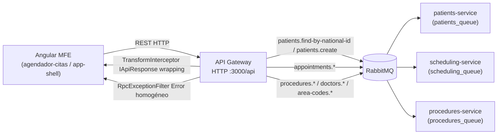

# API Gateway

> **Ficha Técnica del Módulo**
> * **Ubicación en Monorepo:** `services/api-gateway`
> * **Tipo de Módulo:** Microservicio NestJS — Punto de Entrada HTTP
> * **Tags Nx (`project.json`):** `["scope:backend", "type:service"]`
> * **Estado:** Activo

---

## 1. Propósito y Alcance de Negocio

El **API Gateway** es el único punto de entrada HTTP del sistema clínico. Actúa como proxy inteligente que recibe peticiones REST del frontend Angular (MFE `agendador-citas` y `app-shell`) y las enruta hacia los microservicios internos mediante colas **RabbitMQ** (`Transport.RMQ`). Ningún microservicio backend expone HTTP directamente; toda comunicación cliente-servidor pasa obligatoriamente por esta capa.

Su responsabilidad única es: validar el payload de entrada, convertir el transporte HTTP→RMQ, aplicar una respuesta envuelta canónica (`IApiResponse<T>`) y gestionar los errores RPC homogéneamente.

---

## 2. Diagrama de Arquitectura y Flujo de Información


```mermaid
graph LR
    FE["Angular MFE\n(agendador-citas / app-shell)"]
    GW["API Gateway\nHTTP :3000/api"]
    RMQ[(RabbitMQ)]
    PS["patients-service\n(patients_queue)"]
    SC["scheduling-service\n(scheduling_queue)"]
    PR["procedures-service\n(procedures_queue)"]

    FE -->|REST HTTP| GW
    GW -->|patients.find-by-national-id / patients.create| RMQ
    GW -->|appointments.*| RMQ
    GW -->|procedures.* / doctors.* / area-codes.*| RMQ
    RMQ --> PS
    RMQ --> SC
    RMQ --> PR

    GW -->|TransformInterceptor IApiResponse wrapping| FE
    GW -->|RpcExceptionFilter Error homogéneo| FE
```

---

## 3. Contratos de Datos e Interfaces

### A. Interfaces de Contrato (`@nx-boilerplate/api-interfaces`)

| Interfaz | Archivo Origen | Propósito |
|---|---|---|
| `SlotStatusType` | `appointment.interface.ts` | Tipado de estados: `'AVAILABLE' \| 'TENTATIVE' \| 'CONFIRMED' \| 'BLOCKED_PERSONAL'` |
| `ISlotDisplay` | `appointment.interface.ts` | Slot enriquecido con `startTime`, `endTime`, `display`, `title`, `status`, `colorId`, `isBookable`, `googleEventId?` |
| `IDayAvailability` | `appointment.interface.ts` | Disponibilidad diaria agrupada con `isCalendarSynced` y colección `ISlotDisplay[]` |
| `IAvailableDate` | `appointment.interface.ts` | Slot puntual de disponibilidad (legado) |
| `IPatientHistory` | `patient.interface.ts` | Historial completo de paciente con citas y procedimientos |
| `ICreatePatientRequest` | `patient.interface.ts` | Payload de solicitud para registrar nuevo paciente |
| `IAreaCode` | `patient.interface.ts` | Catálogo de indicativos internacionales, banderas y regex |
| `IProcedure` | `procedure.interface.ts` | Procedimiento médico con duración y especialidad |
| `IProfessionalSummary` | `procedure.interface.ts` | Resumen de médico especialista (nombre, email, cédula) |
| `IActiveProfessional` | `procedure.interface.ts` | Médico activo con datos ampliados |
| `IApiResponse<T>` | `api-response.interface.ts` | Sobre de respuesta canónico `{ success, statusCode, message, data }` |
| `IWeekWindow` | `appointment.interface.ts` | Ventana semanal `{ startDate, endDate, totalDays, offsetWeeks }` |
| `IAppointmentDashboard` | `appointment.interface.ts` | Entidad consolidada de cita para dashboard de seguimiento diario |
| `IGetDailyAppointmentsRequest` | `appointment.interface.ts` | Payload de consulta para citas por fecha, médico y estado |
| `IUpdateAppointmentStatusRequest` | `appointment.interface.ts` | Payload de solicitud para actualizar estado (`CONFIRMED` o `CANCELLED`) |
| `ITrackContactRequest` | `appointment.interface.ts` | Payload de evento para registrar contacto con el paciente |

### B. DTOs y Validación Runtime

| DTO | Ubicación | Campos | Decoradores clave | Propósito |
|---|---|---|---|---|
| `GetAvailableDatesQueryDto` | `src/dtos/` | `procedureId?`, `doctorEmail?`, `targetDate?`, `startDate?`, `endDate?` | `@IsEmail`, `@IsDateString`, `@IsOptional` | Query params para disponibilidad semanal |
| `GetDailyAppointmentsQueryDto` | `@nx-boilerplate/shared-dtos` | `date`, `doctorEmail?`, `status?` | `@IsDateString`, `@IsNotEmpty`, `@IsEmail`, `@IsEnum`, `@IsOptional` | Query params para consultar citas del día |
| `CreateAppointmentBodyDto` | `src/dtos/` | `doctorEmail`, `doctorCedula`, `patientNationalId`, `patientFullName`, `patientEmail`, `patientPhone?`, `procedureId`, `procedureName`, `startTime`, `endTime`, `notes?` | `@IsEmail`, `@IsISO8601`, `@IsNotEmpty`, `@IsOptional` | Payload de creación de cita con teléfono para confirmación |
| `UpdateAppointmentStatusDto` | `@nx-boilerplate/shared-dtos` | `appointmentId?`, `status` | `@IsEnum(['CONFIRMED', 'CANCELLED'])`, `@IsOptional` | Payload de actualización de estado de cita |
| `TrackContactDto` | `@nx-boilerplate/shared-dtos` | `appointmentId` | `@IsString`, `@IsNotEmpty` | Validación de ID para registrar contacto con paciente |
| `CreateWaitlistBodyDto` | `src/dtos/` | `patientNationalId`, `patientFullName`, `patientEmail`, `patientPhone`, `procedureId`, `preferredDoctorEmail?` | `@IsEmail`, `@IsNotEmpty` | Payload de inscripción a lista de espera |
| `FindPatientByNationalIdDto` | `@nx-boilerplate/shared-dtos` | `nationalId` | `@IsString`, `@IsNotEmpty` | Parámetro de ruta para consultar paciente |
| `CreatePatientDto` | `@nx-boilerplate/shared-dtos` | `cedula`, `nombre`, `apellidos`, `correo`, `celular`, `ultimosProcedimientos?`, `recomendaciones?` | `@IsString`, `@IsEmail`, `@IsOptional` | Payload de registro de nuevo paciente |

---

## 4. Puntos de Entrada y Comunicación

### Prefijo global: `/api`

**Puerto:** `3000` (configurable vía `PORT`)  
**CORS habilitado:** `http://localhost:4200`, `http://localhost:4201`

---

### 4.1 `AppointmentsController` — `/api/appointments`

#### `GET /api/appointments/daily`

Consulta la lista consolidada de citas programadas para una fecha determinada (`date: YYYY-MM-DD`), diseñada para alimentar el **Dashboard de Gestión y Confirmación Diaria**. Permite filtrar por médico y por estado clínico de la cita (`TENTATIVE`, `CONFIRMED`, `CANCELLED`). Incluye datos de contacto del paciente, estado de respuesta de Google Calendar (`patientResponseStatus`) y el contador acumulado de intentos de contacto (`contactCount`).

| Parámetro Query | Tipo | Requerido | Descripción |
|---|---|---|---|
| `date` | `string (YYYY-MM-DD)` | Sí | Fecha de la jornada clínica a consultar |
| `doctorEmail` | `string (email)` | No | Filtra por el correo del médico asignado |
| `status` | `string` | No | Filtra por estado (`TENTATIVE`, `CONFIRMED`, `CANCELLED`) |

**Respuesta `200 OK` (`IAppointmentDashboard[]`):**
```json
{
  "success": true,
  "statusCode": 200,
  "message": "Operación realizada exitosamente",
  "data": [
    {
      "appointmentId": "APT-1791262275508-237",
      "doctorEmail": "drmoralesheano@gmail.com",
      "doctorCedula": "123456789",
      "patientNationalId": "987654321",
      "patientFullName": "María García",
      "patientEmail": "paciente@email.com",
      "patientPhone": "+573001234567",
      "procedureId": "proc-001",
      "procedureName": "Consulta General",
      "startTime": "2026-10-15T14:00:00.000Z",
      "endTime": "2026-10-15T14:45:00.000Z",
      "status": "TENTATIVE",
      "patientResponseStatus": "needsAction",
      "colorId": "5",
      "googleCalendarEventId": "evt_abc123",
      "notes": "Primera consulta",
      "contactCount": 0
    }
  ]
}
```

* **Patrón RMQ:** `appointments.get-daily` · **Cola:** `scheduling_queue` · **Timeout:** 5 000 ms

---

#### `GET /api/appointments/available-dates`

Consulta la disponibilidad semanal de un médico mediante `events.list` y la regla de **Veto del Médico** (descartando citas canceladas o declinadas por el doctor). Si no se envían `startDate`/`endDate`, el Gateway calcula automáticamente la ventana de la **semana actual en Colombia** usando `getWeekWindow(0)` de `@nx-boilerplate/utils`.

| Parámetro Query | Tipo | Requerido | Descripción |
|---|---|---|---|
| `doctorEmail` | `string (email)` | No | Correo del médico para filtrar disponibilidad |
| `procedureId` | `string` | No | ID del procedimiento para calcular duración de slot |
| `startDate` | `string (YYYY-MM-DD)` | No | Inicio del rango (default: lunes de la semana actual) |
| `endDate` | `string (YYYY-MM-DD)` | No | Fin del rango (default: sábado de la semana actual) |
| `targetDate` | `string (YYYY-MM-DD)` | No | Fecha puntual (legado) |

**Respuesta `200 OK` — Doctor con calendario sincronizado (Slots enriquecidos):**
```json
{
  "success": true,
  "statusCode": 200,
  "message": "Operación realizada exitosamente",
  "data": [
    {
      "date": "2026-10-03",
      "dayName": "Sábado",
      "isCalendarSynced": true,
      "slots": [
        {
          "startTime": "2026-10-03T12:00:00.000Z",
          "endTime": "2026-10-03T12:45:00.000Z",
          "display": "07:00 - 07:45",
          "title": "Espacio disponible",
          "status": "AVAILABLE",
          "colorId": null,
          "isBookable": true
        },
        {
          "startTime": "2026-10-03T14:00:00.000Z",
          "endTime": "2026-10-03T14:45:00.000Z",
          "display": "09:00 - 09:45",
          "title": "Cita Médica: Valoración Facial - Juan Pérez",
          "status": "TENTATIVE",
          "colorId": "5",
          "isBookable": false,
          "googleEventId": "evt_abc123"
        }
      ]
    }
  ]
}
```

**Respuesta `200 OK` — Doctor sin calendario sincronizado:**
```json
{
  "data": [
    {
      "date": "2026-10-03",
      "dayName": "Sábado",
      "isCalendarSynced": false,
      "slots": [
        {
          "startTime": "2026-10-03T12:00:00.000Z",
          "endTime": "2026-10-03T12:45:00.000Z",
          "display": "07:00 - 07:45",
          "title": "Espacio disponible",
          "status": "AVAILABLE",
          "colorId": null,
          "isBookable": true
        }
      ]
    }
  ]
}
```

> **`isCalendarSynced: false`** → El bot no tiene acceso al Google Calendar del médico. Los slots retornados son solo los de MongoDB (sin bloqueos de Google Calendar). El frontend muestra un placeholder de advertencia con el email del médico en cada columna del día.

**Patrón RMQ enviado:** `appointments.get-available-dates` · **Timeout:** 10 000 ms

---

#### `POST /api/appointments`

Crea una cita médica validando disponibilidad en Google Calendar (insertando evento interactivo en ubicación `'Cra 79 # 49A-107, Laureles - Estadio'`, con `sendUpdates: 'all'`, `status: 'tentative'` y `colorId: '5'`) y persistiendo en MongoDB Atlas bajo el estado inicial `TENTATIVE`.

**Body (`CreateAppointmentBodyDto`):**
```json
{
  "doctorEmail": "drmoralesheano@gmail.com",
  "doctorCedula": "123456789",
  "patientNationalId": "987654321",
  "patientFullName": "María García",
  "patientEmail": "paciente@email.com",
  "patientPhone": "3001234567",
  "procedureId": "proc-001",
  "procedureName": "Consulta General",
  "startTime": "2026-10-03T14:00:00.000Z",
  "endTime": "2026-10-03T14:45:00.000Z",
  "notes": "Primera consulta"
}
```

**Respuesta `201 Created`:**
```json
{
  "success": true,
  "statusCode": 201,
  "message": "Operación realizada exitosamente",
  "data": {
    "success": true,
    "message": "Cita reservada y sincronizada exitosamente con Google Calendar",
    "appointmentId": "APT-1791262275508-237",
    "googleCalendarEventId": "mock-google-id-1791262275508",
    "status": "TENTATIVE",
    "colorId": "5",
    "startTime": "2026-10-03T14:00:00.000Z",
    "endTime": "2026-10-03T14:45:00.000Z",
    "doctor": "Dr. Camilo Tabares García"
  }
}
```
* **Patrón RMQ:** `appointments.create` · **Timeout:** 10 000 ms
* **Sincronización:** Inserta la cita con `colorId: '5'` (amarillo/tentativa) en Google Calendar y almacena el teléfono opcional del paciente para habilitar la confirmación interactiva de asistencia vía WhatsApp.

---

#### `PATCH /api/appointments/:id/status`

Actualiza el estado de una cita médica de forma sincrónica y bidireccional entre Google Calendar y la base de datos.
1. **Google Calendar:** Actualiza el evento correspondiente cambiando su color tonal (`10` verde esmeralda para `CONFIRMED`, `11` rojo tomate para `CANCELLED`).
2. **MongoDB Atlas:** Persiste el nuevo estado (`status`) y `colorId` en el documento de la cita.

| Parámetro / Campo | Tipo | Requerido | Descripción |
|---|---|---|---|
| `:id` (Param) | `string` | Sí | Identificador único de la cita (`appointmentId` o `_id`) |
| `status` (Body) | `string` | Sí | Nuevo estado permitido: `CONFIRMED` o `CANCELLED` |

**Body (`UpdateAppointmentStatusDto`):**
```json
{
  "status": "CONFIRMED"
}
```

**Respuesta `200 OK` (`IAppointmentDashboard`):**
```json
{
  "success": true,
  "statusCode": 200,
  "message": "Operación realizada exitosamente",
  "data": {
    "appointmentId": "APT-1791262275508-237",
    "doctorEmail": "drmoralesheano@gmail.com",
    "doctorCedula": "123456789",
    "patientNationalId": "987654321",
    "patientFullName": "María García",
    "patientEmail": "paciente@email.com",
    "patientPhone": "+573001234567",
    "procedureId": "proc-001",
    "procedureName": "Consulta General",
    "startTime": "2026-10-15T14:00:00.000Z",
    "endTime": "2026-10-15T14:45:00.000Z",
    "status": "CONFIRMED",
    "patientResponseStatus": "accepted",
    "colorId": "10",
    "googleCalendarEventId": "evt_abc123",
    "notes": "Primera consulta",
    "contactCount": 1
  }
}
```

* **Patrón RMQ:** `appointments.update-status` · **Cola:** `scheduling_queue` · **Timeout:** 10 000 ms

---

#### `POST /api/appointments/:id/track-contact`

Registra e incrementa de forma atómica el número de intentos de contacto (`contactCount`) realizados al paciente para una cita (llamadas o recordatorios interactivos de WhatsApp). Se gestiona de forma asíncrona mediante emisión de eventos RabbitMQ sin bloquear el cliente HTTP.

| Parámetro | Tipo | Requerido | Descripción |
|---|---|---|---|
| `:id` (Param) | `string` | Sí | Identificador único de la cita (`appointmentId`) |

**Respuesta `202 Accepted`:**
```json
{
  "success": true,
  "statusCode": 202,
  "message": "Registro de contacto encolado exitosamente",
  "data": {
    "message": "Registro de contacto encolado exitosamente"
  }
}
```

* **Patrón RMQ Emitido:** `appointments.contact-tracked` (Evento asíncrono `@EventPattern` via `emit()`) · **Cola:** `scheduling_queue`

---

#### `POST /api/appointments/waitlist`

Inscribe a un paciente en la lista de espera para un procedimiento.

**Patrón RMQ:** `waitlist.create` · **Timeout:** 5 000 ms

---

### 4.2 `PatientsController` — `/api/patients`

#### `GET /api/patients/:nationalId`

Retorna el historial completo del paciente (citas pasadas, datos personales).

**Patrón RMQ:** `patients.find-by-national-id` · **Cola:** `patients_queue`

#### `POST /api/patients`

Registra un nuevo paciente en la base de datos (MongoDB Atlas a través de `patients-service`). Se invoca automáticamente desde el MFE `agendador-citas` cuando se ingresa una cédula no registrada en el Stepper antes de avanzar a la selección de horario.

| Campo Body | Tipo | Requerido | Descripción |
|---|---|---|---|
| `cedula` | `string` | Sí | Documento de identidad único |
| `nombre` | `string` | Sí | Nombres del paciente |
| `apellidos` | `string` | Sí | Apellidos del paciente |
| `correo` | `string (email)` | Sí | Correo electrónico de contacto |
| `celular` | `string` | Sí | Teléfono celular con indicativo internacional |
| `ultimosProcedimientos` | `array` | No | Lista de procedimientos clínicos previos (default: `[]`) |
| `recomendaciones` | `string` | No | Observaciones o recomendaciones médicas (default: `""`) |

**Respuesta `201 Created`** · **Patrón RMQ:** `patients.create` · **Cola:** `patients_queue`

---

### 4.3 `ProceduresController` — `/api/procedures`

#### `GET /api/procedures`

Lista todos los procedimientos. Si se pasa `?doctorCedula=`, filtra los procedimientos que atiende ese médico.

**Patrones RMQ:** `procedures.get-all` / `procedures.find-by-doctor` · **Timeout:** 5 000 ms

#### `GET /api/procedures/:idProcedimiento`

Retorna un procedimiento por ID.

**Patrón RMQ:** `procedures.find-by-id` · **Timeout:** 5 000 ms

#### `GET /api/procedures/:idProcedimiento/doctors`

Lista los médicos que atienden el procedimiento dado.

**Patrón RMQ:** `procedures.get-doctors-by-procedure` · **Timeout:** 5 000 ms

---

### 4.4 `AreaCodesController` — `/api/area-codes`

#### `GET /api/area-codes`

Retorna el catálogo maestro de códigos de área e indicativos internacionales para validación y formateo de números celulares en formularios de agendamiento.

**Respuesta `200 OK`:**
```json
{
  "success": true,
  "statusCode": 200,
  "message": "Operación realizada exitosamente",
  "data": [
    {
      "code": "+57",
      "country": "Colombia",
      "flag": "🇨🇴",
      "patternString": "^3\\d{9}$",
      "errorMessage": "El número celular debe iniciar por 3 y tener 10 dígitos (Colombia)."
    },
    {
      "code": "+1",
      "country": "Estados Unidos / Canadá",
      "flag": "🇺🇸",
      "patternString": "^\\d{10}$",
      "errorMessage": "El número celular debe contener exactamente 10 dígitos."
    }
  ]
}
```

**Patrón RMQ:** `area-codes.get-all` · **Cola:** `procedures_queue` · **Timeout:** 5 000 ms

---

### 4.5 `DoctorsController` — `/api/doctors`

#### `GET /api/doctors`

Lista todos los especialistas activos del sistema.

**Patrón RMQ:** `doctors.get-all` · **Cola:** `procedures_queue` · **Timeout:** 5 000 ms

---

### 4.6 `HealthController` — `/api/health`

#### `GET /api/health`

Endpoint de verificación de disponibilidad del servicio. Retorna `{ status: 'ok' }`.

---

## 5. Infraestructura Transversal

### `TransformInterceptor` (Global)

Envuelve **toda** respuesta exitosa en la estructura canónica `IApiResponse<T>`:

```typescript
interface IApiResponse<T> {
  success: boolean;        // siempre true en caso exitoso
  statusCode: number;      // código HTTP
  message: string;         // mensaje de operación
  data: T | null;          // payload de respuesta
}
```

Si el payload contiene un campo `message: string`, se usa ese texto como mensaje de la respuesta.

### `RpcExceptionFilter` (Global)

Captura `RpcException` lanzadas por los microservicios downstream y las convierte en respuestas HTTP estructuradas con el código de error apropiado.

### `ValidationPipe` (Global)

Configurado con `{ whitelist: true, forbidNonWhitelisted: true, transform: true }`. Aplica validación automática en todos los endpoints usando los DTOs decorados con `class-validator`.

---

## 6. Variables de Entorno Requeridas

| Variable | Default | Descripción |
|---|---|---|
| `PORT` | `3000` | Puerto HTTP del Gateway |
| `RABBITMQ_URI` | `amqp://localhost:5672` | URI de conexión a RabbitMQ |
| `RABBITMQ_PATIENTS_QUEUE` | `patients_queue` | Cola del microservicio de pacientes |
| `RABBITMQ_SCHEDULING_QUEUE` | `scheduling_queue` | Cola del microservicio de agendamiento |
| `RABBITMQ_PROCEDURES_QUEUE` | `procedures_queue` | Cola del microservicio de procedimientos |

---

## 7. Dependencias y Límites Arquitectónicos

**Módulos que consume:**
- `@nx-boilerplate/api-interfaces` — Interfaces de contrato compartidas
- `@nx-boilerplate/shared-dtos` — DTOs con validación runtime (`FindPatientByNationalIdDto`, `FilterProceduresQueryDto`, `FindProcedureParamDto`)
- `@nx-boilerplate/utils` — `getWeekWindow()` para cálculo automático de ventana semanal

**Módulos que lo consumen:**
- `apps/agendador-citas` — MFE principal de agendamiento
- `app-shell` — Host del MFE, proxy de peticiones en desarrollo

---

## 8. Guía de Uso — Ejemplos cURL

```bash
# Disponibilidad semanal (ventana actual automática)
curl "http://localhost:3000/api/appointments/available-dates?doctorEmail=drmoralesheano@gmail.com"

# Disponibilidad con rango explícito
curl "http://localhost:3000/api/appointments/available-dates?doctorEmail=drmoralesheano@gmail.com&startDate=2026-10-05&endDate=2026-10-10"

# Crear cita
curl -X POST http://localhost:3000/api/appointments \
  -H "Content-Type: application/json" \
  -d '{"doctorEmail":"drmoralesheano@gmail.com","doctorCedula":"123","patientNationalId":"456","patientFullName":"Test Paciente","patientEmail":"test@test.com","procedureId":"proc-001","procedureName":"Consulta","startTime":"2026-10-05T14:00:00Z","endTime":"2026-10-05T14:45:00Z"}'

# Listar citas de una jornada diaria (Dashboard)
curl "http://localhost:3000/api/appointments/daily?date=2026-10-15&doctorEmail=drmoralesheano@gmail.com&status=TENTATIVE"

# Actualizar estado de cita (Confirmar o Cancelar)
curl -X PATCH http://localhost:3000/api/appointments/APT-1791262275508-237/status \
  -H "Content-Type: application/json" \
  -d '{"status":"CONFIRMED"}'

# Registrar contacto o intento de notificación al paciente
curl -X POST http://localhost:3000/api/appointments/APT-1791262275508-237/track-contact

# Listar médicos activos
curl http://localhost:3000/api/doctors

# Verificar salud del Gateway
curl http://localhost:3000/api/health
```

---

## 9. Comandos de Verificación (Nx)

```bash
# Servir en desarrollo
npx nx serve api-gateway

# Compilar proyecto
npx nx build api-gateway

# Ejecutar pruebas unitarias
npx nx test api-gateway

# Validar límites arquitectónicos
npx nx lint api-gateway
```
