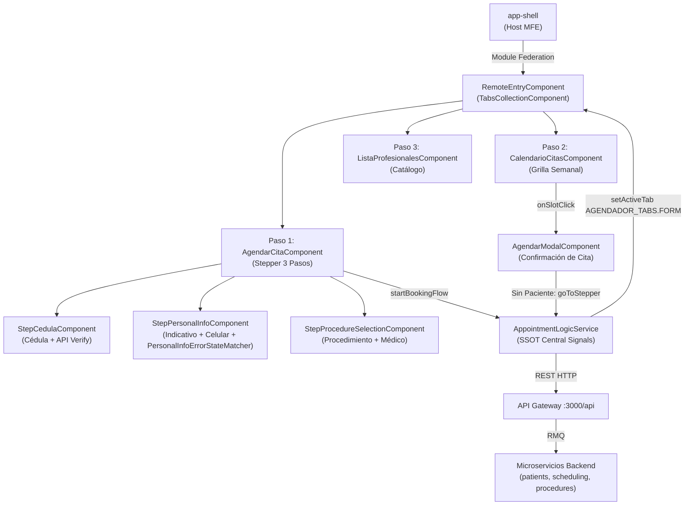

# Agendador de Citas

> **Ficha Técnica del Módulo**
> * **Ubicación en Monorepo:** `apps/agendador-citas`
> * **Tipo de Módulo:** Microfrontend Angular — Remote MFE (Module Federation)
> * **Tags Nx (`project.json`):** `["scope:frontend", "type:app"]`
> * **Puerto de desarrollo:** `4201`
> * **Estado:** Activo

---

## 1. Propósito y Alcance de Negocio

El MFE **Agendador de Citas** es el Remote principal que orquesta la experiencia completa de consulta, selección y agendamiento de citas médicas desde la perspectiva del paciente o del operador clínico. Soporta dos modalidades de acceso:

1. **Flujo Guiado por Stepper (Pestaña "Agendar Cita"):**
   - **Paso 1 (Identificación):** Búsqueda reactiva de paciente por documento de identidad.
   - **Paso 2 (Datos del Paciente):** Auto-poblado si el paciente existe o captura de datos personales (con separación de indicativo internacional y número celular con validación dinámica regex por país). Si el paciente es nuevo, se registra de manera transparente en la base de datos antes de continuar.
   - **Paso 3 (Procedimiento y Fecha):** Selección del procedimiento médico y médico especialista, transfiriendo el contexto y navegando automáticamente al Calendario.
2. **Flujo Libre por Calendario (Pestaña "Calendario"):**
   - Visualización de la disponibilidad semanal real de los especialistas (sincronizada con Google Calendar y MongoDB Atlas).
   - Detección de contexto: si el usuario intenta reservar un horario sin haber identificado a un paciente previamente, el sistema despliega una advertencia en el modal de confirmación con un enlace directo (**"Volver a Agendar cita"**) para transferirlo de inmediato al Stepper.
3. **Consulta de Especialistas (Pestaña "Profesionales Disponibles"):**
   - Directorio de médicos especialistas activos del sistema.

La arquitectura reactiva está gobernada por **Signals**, inyección funcional `inject()` y un único **Single Source of Truth (SSOT)** centralizado en `AppointmentLogicService`.

---

## 2. Diagrama de Arquitectura y Flujo de Información



---

## 3. Estado Reactivo — Signals (SSOT: `AppointmentLogicService`)

El `AppointmentLogicService` es el **único responsable** de la lógica de estado de la feature. Los componentes solo leen Signals públicos de solo lectura (`asReadonly()`).

### A. Signals Públicos (Consumo Readonly)

| Signal | Tipo | Descripción |
|---|---|---|
| `activeTab` | `Signal<AgendadorTabId>` | Pestaña activa (`1`: Agendar Cita, `2`: Calendario, `3`: Profesionales) |
| `weekDays` | `Signal<CalendarDay[]>` | Disponibilidad semanal computada (grilla de 14 slots diarios sincronizada con backend) |
| `activeProfessional` | `Signal<IProfessionalSummary \| null>` | Médico actualmente activo en el calendario |
| `availableProfessionals` | `Signal<IProfessionalSummary[]>` | Catálogo completo de especialistas activos |
| `isLoadingCalendar` | `Signal<boolean>` | Indicador de carga durante la consulta de disponibilidad |
| `currentWeekOffset` | `Signal<number>` | Offset de semana respecto a la semana actual de Colombia (0 = actual, 1 = siguiente, -1 = anterior) |
| `calendarError` | `Signal<string \| null>` | Mensaje de error en caso de fallo al consultar el calendario |
| `procedures` | `Signal<IProcedure[]>` | Catálogo de procedimientos médicos disponibles |
| `patientHistory` | `Signal<IPatientHistory \| null>` | Historial clínico del paciente verificado en el Paso 1 |
| `isNewPatient` | `Signal<boolean>` | `true` si la cédula consultada no existe en el sistema |
| `bookingContext` | `Signal<IBookingContext \| null>` | Contexto temporal de agendamiento transferido desde el Stepper al Calendario |
| `areaCodes` | `Signal<IAreaCode[]>` | Catálogo de indicativos internacionales y expresiones regulares telefónicas |

### B. Métodos de Orquestación Clave

| Método | Propósito |
|---|---|
| `setActiveTab(id: AgendadorTabId)` | Cambia reactivamente la pestaña visible en la vista principal |
| `verifyPatient(cedula: string)` | Consulta `GET /api/patients/:cedula`. Resetea `patientHistory` si la cédula es distinta y marca `isNewPatient` |
| `createPatient(data: ICreatePatientRequest)` | Registra un nuevo paciente en BD vía `POST /api/patients` antes de avanzar al paso 3 |
| `fetchAreaCodes()` | Carga el catálogo de países e indicativos vía `GET /api/area-codes` |
| `startBookingFlow(ctx: IBookingContext)` | Guarda el contexto, selecciona al doctor y navega automáticamente al Calendario (`AGENDADOR_TABS.CALENDAR`) |
| `bookSlot(slot: TimeSlot, notes?: string)` | Ejecuta la reserva de la cita médica en Google Calendar y MongoDB Atlas |
| `clearBookingContext()` | Limpia el contexto temporal tras un agendamiento exitoso |

---

## 4. Contratos de Datos e Interfaces

### A. Interfaces de Contrato (`@nx-boilerplate/api-interfaces`)

| Interfaz | Archivo Origen | Propósito |
|---|---|---|
| `SlotStatusType` | `appointment.interface.ts` | Tipado de estados: `'AVAILABLE' \| 'TENTATIVE' \| 'CONFIRMED' \| 'BLOCKED_PERSONAL'` |
| `ISlotDisplay` | `appointment.interface.ts` | Slot enriquecido con `startTime`, `endTime`, `display`, `title`, `status`, `colorId`, `isBookable`, `googleEventId?` |
| `CalendarDay` | `appointment.interface.ts` | Día del calendario con slots calculados |
| `TimeSlot` | `appointment.interface.ts` | Slot individual con horario, estado (`AVAILABLE` / `TENTATIVE` / `CONFIRMED`), `appEventStatus` y bloqueo fusionado |
| `SlotStatus` | `appointment.interface.ts` | Estado visual del slot: `'disponible' \| 'reservado' \| 'seleccionado'` |
| `IDayAvailability` | `appointment.interface.ts` | Disponibilidad diaria retornada por el backend con `ISlotDisplay[]` |
| `IPatientHistory` | `patient.interface.ts` | Historial médico y datos del paciente registrado |
| `ICreatePatientRequest` | `patient.interface.ts` | Payload para creación de nuevo paciente |
| `IAreaCode` | `patient.interface.ts` | Catálogo de indicativo, país, bandera y patrón regex telefónico |
| `IProcedure` | `procedure.interface.ts` | Procedimiento médico con duración y especialidad |
| `IProfessionalSummary` | `procedure.interface.ts` | Resumen de especialista médico |
| `IBookingPatient` | `appointment.interface.ts` | Datos mínimos de contacto del paciente para reserva |

### B. Modelos Locales del MFE (`apps/agendador-citas/src/app/models/booking.models.ts`)

```typescript
export const AGENDADOR_TABS = {
  FORM: 1,
  CALENDAR: 2,
  PROFESSIONALS: 3,
} as const;

export type AgendadorTabId = (typeof AGENDADOR_TABS)[keyof typeof AGENDADOR_TABS];

export interface IBookingContext {
  patient: IBookingPatient;
  procedure: IProcedure;
  doctor: IProfessionalSummary;
}
```

---

## 5. Arquitectura de Componentes de la Aplicación

### 5.1 `RemoteEntryComponent` (Contenedor Orquestador)
- **Selector:** `app-agendador-citas-entry`
- Integra `TabsCollectionComponent` con preservación de estado del DOM (`preserveContent: true`).
- Enlaza bidireccionalmente la pestaña activa con `appointmentLogic.activeTab()`.

### 5.2 `AgendarCitaComponent` (Formulario Stepper)
- **Selector:** `app-agendar-cita`
- Gobierna un `MatStepper` vertical de 3 pasos:
  1. **Paso 1 (`app-step-cedula`):** Captura la cédula. Al dar clic en "Verificar y Continuar", resetea limpiamente el formulario del Paso 2 (`markAsPristine`, `markAsUntouched`, `step2.interacted = false`) para evitar falsos positivos de validación al conmutar cédulas.
  2. **Paso 2 (`app-step-personal-info`):**
     - Inputs: Nombres, Apellidos, Correo, Indicativo (select con banderas) y Teléfono Celular.
     - **Validación Dinámica:** Al cambiar el indicativo, se reconfigura dinámicamente el validador `pattern` de `numeroCelular` con la regex oficial del país provista por `IAreaCode`.
     - **Aislamiento de ErrorStateMatcher:** Emplea `PersonalInfoErrorStateMatcher` para garantizar que los campos reseteados no aparezcan en rojo por interacción previa del stepper.
     - **Registro Automático:** Si `isNewPatient()` es `true`, al pulsar "Guardar y Continuar" envía `POST /api/patients` antes de avanzar al paso 3.
  3. **Paso 3 (`app-step-procedure-selection`):** Selección de procedimiento y especialista, disparando `startBookingFlow()` hacia la pestaña del Calendario.

### 5.3 `CalendarioCitasComponent` (Grilla Semanal y Confirmación)
- **Selector:** `app-calendario-citas`
- Renderiza la grilla semanal con 14 slots diarios (07:00–19:00, 45 min, receso de almuerzo 12:00–13:00).
- **Separación de Estados de Slots:**
  - **Slots Disponibles (`AVAILABLE`):** Renderizan un botón de acción interactivo con ícono `+` que permite iniciar el proceso de agendamiento.
  - **Slots en Estado Preliminar (`TENTATIVE`):** Renderizan un badge visual distintivo en tonalidad amarilla (`var(--sys-color-tertiary)` / `#ca8a04`), con ícono de reloj (`schedule`), horario, nombre del paciente y nombre del procedimiento médico. Son clickeables para inspección detallada.
  - **Slots Confirmados / Bloqueados (`CONFIRMED` / `BLOCKED_PERSONAL`):** Visualizan bloques continuos reservados sin interacción de sobre-escritura.
- **Modelo Interactivo Google Calendar:** Consume datos enriquecidos provenientes de `events.list` procesados con la regla de Veto del Médico (si el médico o paciente declinan, o el evento se cancela, el horario se libera automáticamente). Las citas se crean en estado inicial `TENTATIVE` con `colorId: '5'`.
- Fusión de bloques reservados consecutivos (`mergedCount`).
- **Control de Acceso y Redirección:**
  - Al hacer clic en un slot disponible abre `AgendarModalComponent`. Si el usuario no tiene paciente asignado en su contexto, el modal despliega la advertencia `"Sin paciente asignado"` y un botón interactivo **"Volver a Agendar cita"**. Al pulsarlo, el modal se cierra con `goToStepper: true` y el componente redirige automáticamente al usuario al Paso 1 del Stepper (`setActiveTab(AGENDADOR_TABS.FORM)`).
  - Al hacer clic en un slot en estado `TENTATIVE`, abre `AgendarModalComponent` en modo vista previa (`isTentativeView: true`, `slotStatus: 'TENTATIVE'`) extrayendo datos del evento (paciente, procedimiento, observaciones).
- Altura optimizada del scroll de la grilla de slots (`max-height: 650px`).

### 5.4 `AgendarModalComponent` (Modal Presentacional Desacoplado)
- **Ubicación:** `libs/shared/layouts/src/lib/modals/agendar-modal/`
- Modal Standalone MD3 que recibe `AgendarModalData` y retorna `AgendarModalResult`:
  ```typescript
  export interface AgendarModalData {
    title: string;
    dateRange: string;
    professional: string;
    patient?: IBookingPatient | null;
    isTentativeView?: boolean;
    slotStatus?: SlotStatusType | null;
    notes?: string;
    startTime?: string;
    endTime?: string;
  }

  export interface AgendarModalResult {
    agendar: boolean;
    notes?: string;
    goToStepper?: boolean;
  }
  ```
- **Sede Médica Oficial:** `'Cra 79 # 49A-107, Laureles - Estadio'`.
- **Capa de Privacidad del Paciente:** El número telefónico no se expone directamente en texto plano dentro de la tarjeta del paciente para proteger datos sensibles.
- **Botón `Confirmar cita` (WhatsApp):**
  - Condicionado a slots en estado `TENTATIVE` con teléfono disponible (`@if (isTentativeStatus() && patientWhatsAppUrl())`).
  - Ubicado a la derecha de la tarjeta (`margin-left: auto`), centrado verticalmente con el nombre y documento del paciente.
  - Diseñado con estilo distintivo de WhatsApp (`#25d366`, micro-interacciones hover).
  - Genera automáticamente el enlace directo hacia WhatsApp con la plantilla corporativa:
    ```text
    Hola [Nombre], te escribimos de Dras. Botero para confirmar tu cita con el/la Dr(a). [Profesional] el [Fecha]. ¿Nos confirmas tu asistencia con un SÍ?
    ```
- **Integración con Google Calendar:** Expone `googleCalendarInviteUrl` computado dinámicamente (`render?action=TEMPLATE&text=...&dates=...&details=...&location=...`) para sincronizar el evento en agendas externas.

---

## 6. Dependencias y Límites Arquitectónicos

* **Módulos que consume:**
  - `@nx-boilerplate/api-interfaces` — Contratos de pacientes, disponibilidad, procedimientos y códigos de área.
  - `@nx-boilerplate/layouts` — `TabsCollectionComponent`, `AgendarModalComponent`, `ConfirmationModalComponent`, componentes del stepper (`StepCedulaComponent`, `StepPersonalInfoComponent`, `StepProcedureSelectionComponent`).
  - `@nx-boilerplate/theme` — Variables y Design Tokens MD3.
  - `@nx-boilerplate/data-access` — `ApiClientService` para consumo REST.
  - `@angular/material` — Stepper, Forms, Dialogs, Buttons, Select, Icons.

* **Módulos que lo consumen:**
  - `app-shell` — Host de Microfrontends que monta este módulo como Remote bajo Module Federation (`exposes: { './Routes': ... }`).

---

## 7. Comandos de Verificación (Nx)

```bash
# Servir en desarrollo como Remote individual
npx nx serve agendador-citas

# Servir integrado en el host completo
npx nx serve app-shell

# Compilar aplicación
npx nx build agendador-citas

# Validar calidad y reglas arquitectónicas (Lint)
npx nx lint agendador-citas
```
