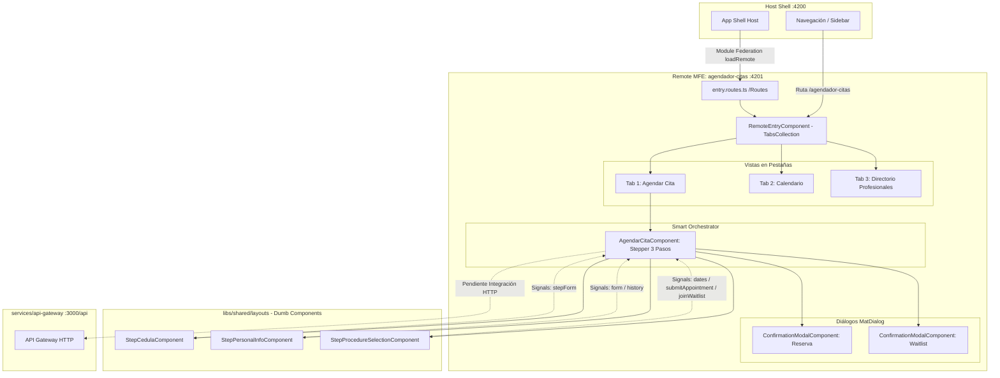

# Agendador de Citas (MFE Remote)

> **Ficha Técnica del Módulo**  
> * **Ubicación en Monorepo:** `apps/agendador-citas`  
> * **Tipo de Módulo:** Microfrontend Angular 21+ (Remote Standalone en Module Federation)  
> * **Tags Nx (`project.json`):** `["scope:frontend", "type:app"]`  
> * **Puerto Dev Local:** `4201` (`http://localhost:4201`)  
> * **Host Principal:** `app-shell` (`http://localhost:4200`)  
> * **Estado:** Activo (Fase de Maquetación UI / Stepper Reactivo)  

---

## 1. Propósito y Alcance de Negocio

La aplicación **`agendador-citas`** es un microfrontend (Remote MFE) autónomo responsable de toda la experiencia de usuario orientada al autoservicio y gestión asistida de citas para procedimientos médicos y estéticos.

Su objetivo principal es guiar al paciente a través de un embudo conversacional estructurado (Stepper reactivo) que valida su identidad, recupera y muestra sus antecedentes clínicos previos, permite la selección ágil del procedimiento deseado y facilita la reserva en tiempo real de turnos disponibles sincronizados con Google Calendar y MongoDB Atlas, contemplando mecanismos de resiliencia como la suscripción a listas de espera reactivas en caso de no hallar disponibilidad.

---

## 2. Diagrama de Arquitectura y Flujo de Información



---

## 3. Contratos de Datos, Modelos e Interfaces

### A. Interfaces de Presentación UI (`@nx-boilerplate/layouts`)

Definidas en `libs/shared/layouts/src/lib/models/appointment-steps.models.ts`:

| Interfaz | Campos Principales | Propósito |
|---|---|---|
| `PatientHistory` | `cedula`, `nombreCompleto`, `ultimosProcedimientos`, `recomendaciones` | Datos clínicos y antecedentes del paciente para el paso 2. |
| `ProcedureItem` | `id`, `nombre`, `fecha`, `profesional` | Procedimiento previo registrado en el historial médico. |
| `AvailableDate` | `id`, `fecha`, `hora`, `profesional?`, `disponible` | Slot horario para selección de turnos en el paso 3. |
| `MedicalProcedureOption`| `id`, `nombre`, `duracion`, `especialidad` | Opción del catálogo para el autocompletado en el paso 3. |
| `TabItemConfig` | `id`, `label`, `icon`, `disabled`, `contentTemplate` | Configuración para `TabsCollectionComponent`. |
| `ConfirmationModalData<T>`| `title`, `text`, `actions` | Payload genérico para `ConfirmationModalComponent`. |

### B. Mapeo hacia Contratos Canónicos del Backend (`@nx-boilerplate/api-interfaces`)

Para la conexión definitiva con los microservicios y el API Gateway, la capa de datos mapeará las interfaces visuales a los contratos globales:

| Contrato Backend | Ubicación en Monorepo | Endpoint API Gateway |
|---|---|---|
| `IPatientHistory` | `libs/shared/api-interfaces/src/lib/patient.interface.ts` | `GET /api/patients/:id/history` |
| `IProcedure` | `libs/shared/api-interfaces/src/lib/procedure.interface.ts` | `GET /api/procedures` |
| `IProfessionalSummary` | `libs/shared/api-interfaces/src/lib/procedure.interface.ts` | `GET /api/procedures/:id/doctors` |
| `IAvailableDate` / `IDayAvailability` | `libs/shared/api-interfaces/src/lib/appointment.interface.ts` | `GET /api/appointments/available-dates` |
| `ICreateAppointmentRequest` | `libs/shared/api-interfaces/src/lib/appointment.interface.ts` | `POST /api/appointments` |
| `ICreateWaitlistRequest` | `libs/shared/api-interfaces/src/lib/appointment.interface.ts` | `POST /api/appointments/waitlist` |
| `IApiResponse<T>` | `libs/shared/api-interfaces/src/lib/api-response.interface.ts` | Envoltorio estándar (Envelope Pattern) |

---

## 4. Estructura de Vistas y Componentes

### A. Vista Contenedora: `RemoteEntryComponent`
* **Ubicación:** `apps/agendador-citas/src/app/remote-entry/remote-entry.component.ts`
* **Mecanismo:** Consume `TabsCollectionComponent` proyectando 3 `ng-template` independientes mediante `viewChild()` y un `computed()` puro:
  1. `appointmentTab`: Incrusta `<app-agendar-cita />`.
  2. `calendarTab`: Incrusta `<app-calendario-citas />` (vista de calendario).
  3. `professionalsTab`: Incrusta `<app-lista-profesionales />` (directorio de médicos).

### B. Orquestador Principal: `AgendarCitaComponent`
* **Ubicación:** `apps/agendador-citas/src/app/components/agendar-cita/agendar-cita.component.ts`
* **Patrón:** Smart Component con `ChangeDetectionStrategy.OnPush` y formulación reactiva fuertemente tipada con `FormBuilder`.
* **Estructura del Stepper:**
  * **Paso 1 (Identificación):**
    * Componente: `StepCedulaComponent` (`input.required<FormGroup>()`).
    * Validación: Requerido y regex numérico (`Validators.pattern(/^[0-9]+$/)`).
    * Acción: `verifyCedula()` comprueba el documento y precarga reactivamente los datos del paciente y el historial.
  * **Paso 2 (Datos del Paciente):**
    * Componente: `StepPersonalInfoComponent`.
    * Inputs: `form` (`FormGroup`), `history` (`PatientHistory | null`).
    * Controles: `nombre`, `apellidos`, `correo`, `celular`, `recordatorioWhatsapp`.
    * Visualización: Resumen del historial médico con badge de tratamientos anteriores y recomendaciones clínicas.
  * **Paso 3 (Procedimiento y Fecha):**
    * Componente: `StepProcedureSelectionComponent`.
    * Inputs: `form` (`FormGroup`), `dates` (`AvailableDate[]`).
    * Outputs: `submitAppointment` (dispara modal de reserva), `joinWaitlist` (dispara modal de lista de espera).
    * Autocompletado: Búsqueda reactiva con `MatAutocomplete` filtrando catálogo de procedimientos.
  * **Modales y Diálogos:**
    * Inyecta `MatDialog` vía `inject(MatDialog)`.
    * Presenta confirmaciones con `ConfirmationModalComponent` con tipado estricto `ConfirmationModalData<boolean>`.

### C. Componentes de Consulta (Placeholders Actuales):
* **`CalendarioCitasComponent`:** Base visual para agenda semanal y mensual de turnos.
* **`ListaProfesionalesComponent`:** Directorio médico para consultar perfiles y horarios de trabajo de los doctores facultados.

---

## 5. Puntos de Entrada y Configuración Module Federation

### A. Exposición MFE (`module-federation.config.ts`)
```typescript
import { ModuleFederationConfig } from '@nx/module-federation';

const config: ModuleFederationConfig = {
  name: 'agendador-citas',
  exposes: {
    './Routes': 'apps/agendador-citas/src/app/remote-entry/entry.routes.ts',
  },
};

export default config;
```

### B. Enrutamiento Remoto (`entry.routes.ts`)
```typescript
import { Route } from '@angular/router';
import { RemoteEntryComponent } from './remote-entry.component';

export const remoteRoutes: Route[] = [
  { path: '', component: RemoteEntryComponent },
];
```

### C. Consumo desde `app-shell` (`app-shell/src/app/app.routes.ts`)
```typescript
import { Route } from '@angular/router';
import { loadRemote } from '@module-federation/enhanced/runtime';

export const appRoutes: Route[] = [
  {
    path: 'agendador-citas',
    loadChildren: () =>
      loadRemote<typeof import('agendador-citas/Routes')>(
        'agendador-citas/Routes'
      ).then((m) => m!.remoteRoutes),
  },
];
```

---

## 6. Dependencias y Límites Arquitectónicos (Nx)

### A. Dependencias Consumidas
* **`@nx-boilerplate/layouts`:** Componentes de presentación (Dumb UI): `TabsCollectionComponent`, `StepCedulaComponent`, `StepPersonalInfoComponent`, `StepProcedureSelectionComponent`, `ConfirmationModalComponent`.
* **`@nx-boilerplate/theme`:** Sistema de diseño MD3 (`--sys-color-*`, tipografía, iconos `material-symbols-outlined`).
* **Angular Material:** `@angular/material/stepper`, `@angular/material/button`, `@angular/material/icon`, `@angular/material/dialog`, `@angular/material/form-field`, `@angular/material/input`, `@angular/material/autocomplete`, `@angular/material/card`.

### B. Límites Arquitectónicos
* **Scope Frontend:** Etiquetado con `["scope:frontend", "type:app"]`. No puede importar directamente módulos de backend (`libs/backend/*` o `services/*`).
* **Zoneless & Signals:** Configurado con `provideZonelessChangeDetection()` en `app.config.ts`.
* **Zero-Legacy:** Prohibido el uso de constructores de inyección (`inject()` mandatorio) y decoradores `@Input()` / `@Output()` (Signals obligatorios).

---

## 7. Diagnóstico Actual y Hoja de Ruta de Integración

| Funcionalidad | Estado Actual | Integración Pendiente (Roadmap) |
|---|:---:|---|
| **Estructura Visual y Stepper** | ✅ 100% Maquetado | Ajuste de estilos menores si MD3 sufre variaciones. |
| **Búsqueda de Cédula** | ⚠️ Mock (`'123456'`) | Conectar a `GET /api/patients/:id/history` vía servicio HTTP. |
| **Catálogo de Procedimientos** | ⚠️ Estático en UI | Consumir desde endpoint o maestro de procedimientos. |
| **Horarios Disponibles** | ⚠️ 3 slots fijos | Conectar a `GET /api/appointments/available-dates` pasando filtros de doctor y procedimiento. |
| **Confirmación de Cita** | ⚠️ `console.log()` | Conectar a `POST /api/appointments` con payload `ICreateAppointmentRequest`. |
| **Lista de Espera** | ⚠️ `console.log()` | Conectar a `POST /api/appointments/waitlist` con payload `ICreateWaitlistRequest`. |
| **Calendario y Profesionales** | ⚠️ Placeholders | Implementar vistas completas consumiendo APIs de médicos y agenda. |

---

## 8. Comandos de Verificación (Nx)

```bash
# Servir de forma independiente (Standalone Remote en puerto 4201)
npx nx serve agendador-citas --port=4201

# Servir de forma integrada con el Shell (Puerto 4200)
npx nx serve app-shell

# Compilar proyecto en modo desarrollo
npx nx build agendador-citas --configuration=development

# Compilar en modo producción
npx nx build agendador-citas --configuration=production

# Ejecutar validaciones de lint y fronteras de módulos
npx nx lint agendador-citas
```
