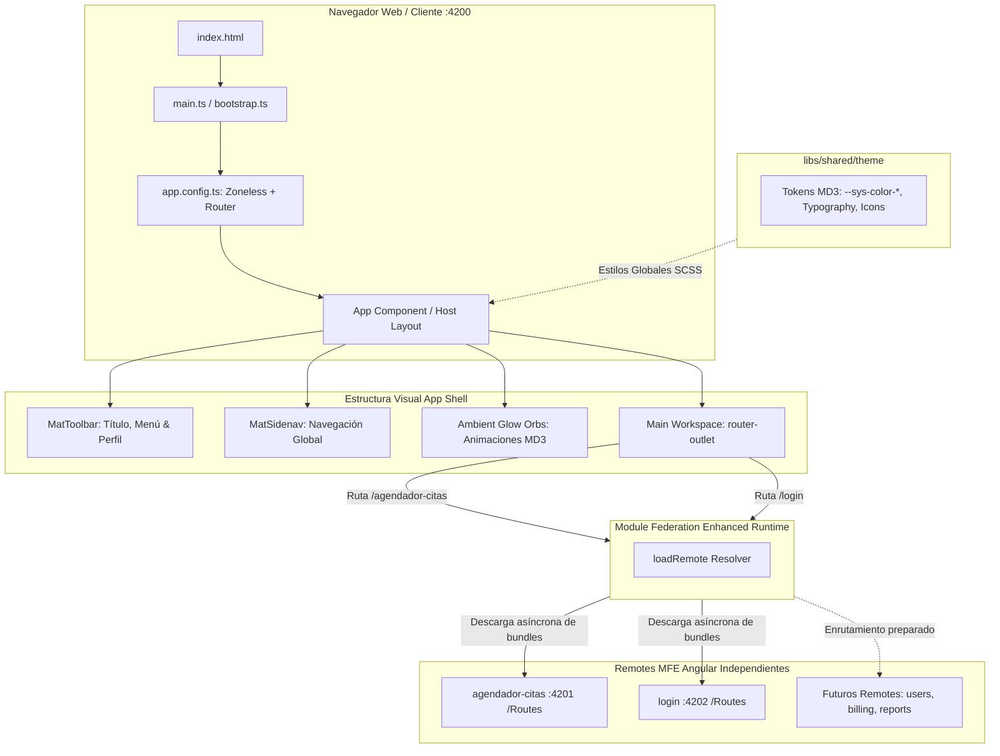

# App Shell (Host MFE)

> **Ficha Técnica del Módulo**  
> * **Ubicación en Monorepo:** `app-shell`  
> * **Tipo de Módulo:** Host Microfrontend Angular 21+ (Webpack Module Federation Host)  
> * **Tags Nx (`project.json`):** `["scope:frontend", "type:app"]`  
> * **Puerto Dev Local:** `4200` (`http://localhost:4200`)  
> * **Remotes Federados:** `agendador-citas` (:4201), `login` (:4202)  
> * **Estado:** Activo (Contenedor y Shell de Navegación Global)  

---

## 1. Propósito y Alcance de Negocio

El **`app-shell`** es la aplicación anfitriona (Host) y punto de entrada unificado para el usuario final en la arquitectura de Microfrontends (MFE). Su responsabilidad principal es proveer el marco de trabajo estructural (Shell), la identidad visual corporativa ("Dras Botero") y la orquestación de la navegación global.

Entre sus responsabilidades clave se encuentran:
1. **Contenedor Estructural de Layout:** Centraliza el encabezado superior (`MatToolbar`), el menú lateral retráctil (`MatSidenav`) y el área de trabajo dinámica donde se proyectan los microfrontends mediante `<router-outlet>`.
2. **Gobernanza de Estilos y Theming MD3:** Inyecta globalmente los Design Tokens, tipografías e iconos nativos de Material Design 3 definidos en `@nx-boilerplate/theme`, además de renderizar fondos ambientales animados (*Ambient Glow Orbs*).
3. **Carga Perezosa de Remotes Federados:** Resuelve dinámicamente en tiempo de ejecución (`Runtime Federation`) los paquetes remotos expuestos por cada microfrontend utilizando `@module-federation/enhanced/runtime`.

---

## 2. Diagrama de Arquitectura y Flujo de Información



---

## 3. Contratos y Estado Reactivo de Navegación

### A. Modelo de Enrutamiento (`MfeRoute`)

Definido localmente en `app-shell/src/app/app.ts` para tipar estrictamente el catálogo de microfrontends accesibles desde el menú lateral:

```typescript
interface MfeRoute {
  path: string;
  label: string;
  icon: string;
}
```

### B. Estado Reactivo con Signals

La reactividad del Host está gobernada por Signals puros y detección de cambios `OnPush`:

| Signal | Tipo | Valor Inicial | Propósito |
|---|---|---|---|
| `isSidenavOpen` | `WritableSignal<boolean>` | `false` | Controla la apertura/cierre del panel lateral retráctil (`mode="over"`). |
| `mfeRoutes` | `WritableSignal<MfeRoute[]>` | Lista de 5 rutas | Catálogo reactivo de aplicaciones remotas enlazadas al Sidenav. |

### C. Control Flow Moderno en Plantilla (`app.html`)

El menú lateral itera la lista de aplicaciones mediante `@for` y maneja estados vacíos con `@empty`:

```html
<mat-nav-list class="shell-nav-list">
  @for (route of mfeRoutes(); track route.path) {
    <a mat-list-item [routerLink]="route.path" routerLinkActive="is-active" class="shell-nav-item">
      <mat-icon matListItemIcon class="nav-icon">{{ route.icon }}</mat-icon>
      <span matListItemTitle class="nav-label">{{ route.label }}</span>
    </a>
  } @empty {
    <div class="shell-empty-state">
      <p>No hay aplicaciones disponibles.</p>
    </div>
  }
</mat-nav-list>
```

---

## 4. Configuración de Module Federation y Enrutamiento

### A. Configuración Host (`module-federation.config.ts`)

Declara los nombres simbólicos de los microfrontends remotos que el host está autorizado a resolver:

```typescript
import { ModuleFederationConfig } from '@nx/module-federation';

const config: ModuleFederationConfig = {
  name: 'app-shell',
  remotes: ['agendador-citas', 'Login'],
};

export default config;
```

### B. Enrutamiento Federado Dinámico (`app.routes.ts`)

Utiliza la función `loadRemote` de `@module-federation/enhanced/runtime` para resolver asíncronamente las rutas expuestas por cada remote sin acoplamiento en tiempo de compilación:

```typescript
import { Route } from '@angular/router';
import { loadRemote } from '@module-federation/enhanced/runtime';

export const appRoutes: Route[] = [
  {
    path: '',
    redirectTo: 'agendador-citas',
    pathMatch: 'full',
  },
  {
    path: 'agendador-citas',
    loadChildren: () =>
      loadRemote<typeof import('agendador-citas/Routes')>(
        'agendador-citas/Routes'
      ).then((m) => m!.remoteRoutes),
  },
  {
    path: 'dashboard',
    redirectTo: 'agendador-citas',
  },
  {
    path: 'login',
    loadChildren: () =>
      loadRemote<typeof import('Login/Routes')>('Login/Routes').then(
        (m) => m!.remoteRoutes
      ),
  },
  {
    path: 'Login',
    redirectTo: 'login',
  },
];
```

### C. Proveedores de la Aplicación (`app.config.ts`)

```typescript
export const appConfig: ApplicationConfig = {
  providers: [
    provideZonelessChangeDetection(),
    provideBrowserGlobalErrorListeners(),
    provideRouter(appRoutes),
  ],
};
```

---

## 5. Diseño Visual, Layout y Theming Material Design 3

### A. Sistema de Capas y Orbs Ambientales (`app.scss`)
El shell incorpora un fondo dinámico con tres "Orbs" tonales animados mediante CSS `@keyframes` (`floatOrbOne`, `floatOrbTwo`, `floatOrbThree`) que utilizan gradientes radiales basados en los tokens semánticos de MD3:
* **Orb Uno:** `var(--sys-color-primary)` con blur de 100px.
* **Orb Dos:** `var(--sys-color-tertiary)` con blur de 100px.
* **Orb Tres:** `var(--sys-color-secondary)` con blur de 100px.

### B. Integración de Iconos Nativa MD3
El componente raíz configura globalmente el set de iconos a `material-symbols-outlined`:
```typescript
providers: [
  {
    provide: MAT_ICON_DEFAULT_OPTIONS,
    useValue: { fontSet: 'material-symbols-outlined' },
  },
]
```

---

## 6. Dependencias y Límites Arquitectónicos (Nx)

### A. Dependencias Consumidas
* **`@nx-boilerplate/theme`:** Consumo directo en `styles.scss` (`@use '../../libs/shared/theme/src/lib/theme';`).
* **Angular Material MD3:** `MatSidenavModule`, `MatToolbarModule`, `MatButtonModule`, `MatIconModule`, `MatListModule`.
* **Nx & Module Federation:** `@nx/angular`, `@module-federation/enhanced`.

### B. Límites Arquitectónicos
* **Scope Frontend:** Taggeado con `["scope:frontend", "type:app"]`. No tiene acceso directo a código ni entidades de backend.
* **Zoneless:** No depende de `zone.js`. Utiliza `provideZonelessChangeDetection()`.
* **Zero-Legacy:** Sin `@NgModule`, inyecciones limpias y componentes standalone.

---

## 7. Diagnóstico Actual y Hoja de Ruta de Evolución

| Capacidad | Estado | Descripción / Siguiente Paso |
|---|:---:|---|
| **Layout Shell (Navbar + Sidenav)** | ✅ Operativo | Maquetación con MD3, navegación colapsable y brand "Dras Botero". |
| **Carga de Remote `agendador-citas`** | ✅ Operativo | Carga lazy transparente en ruta `/agendador-citas`. |
| **Carga de Remote `login`** | ✅ Configurado | Preparado para recibir el MFE de autenticación en `/login`. |
| **Rutas Futuras en Sidenav** | ⚠️ Enlazadas a UI | `/mfe-users`, `/mfe-billing`, `/mfe-reports` y `/settings` listas para cuando se creen los remotes respectivos. |
| **Error Boundary de Remotes** | ⚠️ Pendiente | Implementar un componente de fallback en el router en caso de que un microfrontend remote esté caído o inaccesible por red. |
| **Gestión de Sesión Global** | ⚠️ Pendiente | Compartir estado de autenticación (Token JWT / Perfil de usuario) entre el Shell y los remotes. |

---

## 8. Comandos de Verificación (Nx)

```bash
# Servir el Host en modo orquestado (Lanza concurrentemente los remotes federados en dev)
npx nx serve app-shell

# Compilar proyecto en modo desarrollo
npx nx build app-shell --configuration=development

# Compilar en modo producción
npx nx build app-shell --configuration=production

# Ejecutar pruebas unitarias (Vitest)
npx nx test app-shell

# Validar calidad y límites de módulos (Lint)
npx nx lint app-shell
```
