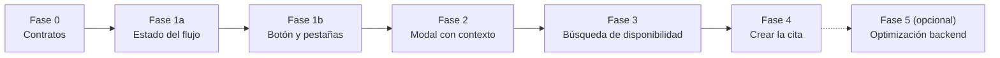
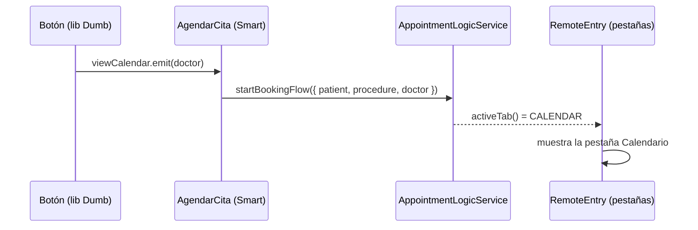

# Plan de acción: Agendar cita desde el Stepper hasta el Calendario

> **Qué vamos a construir:** hoy el *Stepper* (formulario de agendamiento) y el *Calendario* funcionan como dos islas. Al terminar este plan, el usuario llena sus datos, elige un procedimiento, pulsa **"Ver calendario"** en un especialista y llega directo a la agenda de ese médico, ya posicionada en la primera semana con espacios libres. Ahí elige un horario, confirma en el modal y la cita queda creada.
>
> Documentos base: [revision_prompt_fase_0_y_1a.md](./revision_prompt_fase_0_y_1a.md) · [api-gateway.md](./api-gateway.md)

---

## Mapa general

| Fase | Skill principal | ¿Se ve algo en pantalla? | Tamaño |
|---|---|---|---|
| 0 – Contratos | `angular-data-expert` (+ reglas de `nest-microservices`) | No | S |
| 1a – Estado del flujo | `angular-data-expert` | No | S |
| 1b – Botón y pestañas | `angular-ui-expert` | **Sí**: el botón te lleva al calendario | M |
| 2 – Modal con contexto | `angular-ui-expert` | **Sí**: el modal muestra al paciente | M |
| 3 – Búsqueda de disponibilidad | `angular-data-expert` | **Sí**: salta a la primera semana libre | M |
| 4 – Crear la cita | `angular-data-expert` + `angular-ui-expert` | **Sí**: la cita se guarda | M |
| 5 – Optimización (opcional) | `nest-microservices` | No (es más rápido) | L |

> 💡 **Regla para elegir la skill:** si tocas un `signal` del servicio, HTTP o RxJS → `angular-data-expert`. Si tocas un template, `input()/output()` o Material → `angular-ui-expert`. Si tocas `services/` o `libs/backend/` → `nest-microservices`.

> ✅ **Cada fase termina en un commit** que compila (`npx nx build ...`) y no rompe lo anterior. Así, si algo sale mal, sabes exactamente dónde.

---

## Fase 0 — Contratos ("ponernos de acuerdo en la forma de los datos")

### ¿Por qué primero?
Antes de mover datos entre pantallas, hay que definir **qué forma tienen**. Es como acordar el formato de un formulario en papel antes de repartirlo: si cada uno lo llena distinto, nadie se entiende. AGENTS.md exige este orden (*contrato → backend → frontend*).

### Tareas
| Archivo | Cambio |
|---|---|
| `libs/shared/api-interfaces/src/lib/calendar.interface.ts` | `TimeSlot` + `startTime?` y `endTime?` (ISO 8601) |
| `libs/shared/api-interfaces/src/lib/appointment.interface.ts` | Nuevas `IBookingPatient` e `ICreateAppointmentBody` (espejo del DTO del gateway) |
| `services/api-gateway/src/dtos/appointment-gateway.dto.ts` | `CreateAppointmentBodyDto implements ICreateAppointmentBody` |
| `apps/agendador-citas/src/app/models/booking.models.ts` (nuevo) | `AGENDADOR_TABS`, `AgendadorTabId`, `IBookingContext` |
| `apps/agendador-citas/src/app/remote-entry/remote-entry.component.ts` | Usar `AGENDADOR_TABS.*` como `id` de las pestañas |

### Resultado
- **Para el usuario:** nada cambia todavía.
- **Para el equipo:** existe un "idioma común". Si alguien cambia el DTO del backend sin actualizar el contrato, **el build falla y avisa** gracias al `implements`.
- Las pestañas ya no dependen de números mágicos (`1`, `2`), sino de nombres (`AGENDADOR_TABS.CALENDAR`).

### ⚠️ Cuidado
- **No** elimines `ICreateAppointmentRequest`: lo usa `libs/shared/dtos` en el backend.

### Verificación
`npx nx build api-gateway` · `npx nx build agendador-citas`

---

## Fase 1a — Estado del flujo ("la memoria compartida")

### Idea clave
El Stepper y el Calendario están en pestañas distintas y **no se conocen entre sí**. Necesitan una "pizarra" común donde uno escribe y el otro lee: esa pizarra es el `AppointmentLogicService`.

### Tareas (en `appointment-logic.service.ts`)
1. `#activeTab` / `activeTab` / `setActiveTab()`: qué pestaña está abierta.
2. `#bookingContext` / `bookingContext`: a quién estamos agendando (paciente + procedimiento + doctor).
3. `isBookingMode = computed(...)`: `true` si hay un agendamiento en curso.
4. `startBookingFlow(ctx)`: guarda el contexto → selecciona al doctor (buscándolo por cédula en `availableProfessionals`) → cambia a `AGENDADOR_TABS.CALENDAR`.
5. `clearBookingContext()`: borra la pizarra.
6. En `#fetchCalendarWeek`, **solo** cambiar el `Set` por un `Map` para **guardar** `startTime/endTime` en cada slot disponible.
7. `confirmBooking(body: ICreateAppointmentBody)` → `POST /api/appointments` (todavía no se llama desde la UI).
8. `createAppointment()` → marcarlo como `@deprecated`.

### Resultado
- **Para el usuario:** nada visible aún.
- **Para el equipo:** el servicio ya "sabe" iniciar un agendamiento. Si en la consola llamas a `startBookingFlow(...)`, el doctor cambia y los slots disponibles traen su hora ISO real.

### ⚠️ Cuidado
- **No** tocar el `effect()` ni el pipeline RxJS: eso es de la Fase 3.

### Verificación
`npx nx lint agendador-citas` · `npx nx build agendador-citas`

---

## Fase 1b — Botón y pestañas ("conectar los cables")

### Idea clave
El botón "Ver calendario" vive en una librería **Dumb** (`StepProcedureSelectionComponent`). Un componente Dumb es como un control remoto: **avisa** que lo presionaron, pero no sabe qué televisor encender. Quien decide es el componente **Smart** (`AgendarCitaComponent`).

### Tareas
| Archivo | Cambio |
|---|---|
| `step-procedure-selection.component.ts/.html` (lib) | `readonly viewCalendar = output<IProfessionalSummary>()` y `(click)="viewCalendar.emit(doctor)"` |
| `agendar-cita.component.ts/.html` | `onViewCalendar(doctor)`: arma `IBookingPatient` **desde el form** (Paso 1 + Paso 2), busca el `IProcedure` por id y llama a `startBookingFlow()` |
| `remote-entry.component.html` | `[activeTabId]="logic.activeTab()"` + `(activeTabIdChange)="logic.setActiveTab($event)"` |
| `tabs-collection` (lib) | Input `preserveContent` → `mat-tab-group [preserveContent]` para **no perder el formulario** al cambiar de pestaña |

> 📝 **¿Por qué el paciente sale del formulario y no de `patientHistory()`?** Si el paciente es **nuevo**, `patientHistory()` vale `null`, y sus datos solo existen en lo que escribió en el Paso 2.

### Resultado
- **Para el usuario:** al pulsar **"Ver calendario"** en un especialista, la app **salta sola** a la pestaña Calendario, con ese médico seleccionado en el filtro.
- Si vuelve a la pestaña "Agendar Cita", **su formulario sigue lleno**.

### Verificación
Prueba manual del flujo + `npx nx build agendador-citas`.

---

## Fase 2 — Modal con contexto ("el modal sabe para quién es la cita")

### Tareas
| Archivo | Cambio |
|---|---|
| `agendar-modal.models.ts` (lib) | `patient?: IBookingPatient \| null`. **Eliminar** los alias `fecha`/`profesional` (deuda técnica) |
| `agendar-modal.component.ts` (lib) | Simplificar los `computed` del paciente (sin uniones raras) |
| `calendario-citas.component.ts` | En `onSlotClick`, leer `bookingContext()` y enviar `{ title: procedure.nombreProcedimiento, dateRange, professional, patient }` |
| `calendario-citas.component.html` | Banner "Agendando para: Juan Pérez · Botox — **[Cancelar]**" visible si `isBookingMode()`; "Cancelar" llama a `clearBookingContext()` |

> 📝 El doctor del modal sale de `activeProfessional()` **al momento del clic**, porque el usuario puede cambiarlo en el filtro del calendario.

### Resultado
- **Modo agendamiento** (viene del Stepper): el modal muestra el nombre y la cédula del paciente, el procedimiento y el botón **"Confirmar Cita" habilitado**.
- **Modo consulta** (entra directo a la pestaña): el modal sigue en solo lectura, con el aviso "Sin paciente asignado", como hoy.
- Todavía **no se guarda nada**: al confirmar, solo se ve el `console.log` con `{ agendar: true, notes }`.

### Verificación
Probar ambos modos + `npx nx build agendador-citas` + `npx nx lint layouts`.

---

## Fase 3 — Búsqueda de disponibilidad ("no mostrar semanas vacías")

### Problema que resolvemos
Si el médico tiene la semana actual llena, el usuario ve un calendario sin espacios y cree que no hay agenda. Queremos **avanzar solos** hasta encontrar la primera semana con espacios (máximo 4 semanas).

### Tareas (en `appointment-logic.service.ts`)
1. **Reemplazar el `effect()` que hace fetch** por un `Subject` de "peticiones de semana" + `switchMap`.
   > 🧠 **¿Por qué?** El `effect()` actual se dispara cada vez que cambia el offset. Si la búsqueda cambia el offset en cada intento, el effect lanza **otra petición en paralelo** → bucle y respuestas que se pisan. `switchMap` cancela la petición anterior cuando llega una nueva.
2. **Búsqueda con `expand`**: intento 0 → ¿hay slots disponibles (después de filtrar pasados, domingos y no sincronizados)? → sí: cortar · no: intento +1. Límite: **offsets 0, 1, 2 y 3**.
3. **Solo al final**, fijar `#currentWeekOffset` en la semana encontrada (sin disparar otro fetch).
4. **Cuándo aplica:** solo en `startBookingFlow()` y al cambiar de doctor. Los botones "semana anterior/siguiente" siguen pidiendo **una sola semana**.
5. Nuevo `#calendarError` / `calendarError`: si no hay nada en 4 semanas → `console.warn('No hay espacios disponibles hasta <fecha>')` y mensaje en la UI con un botón "Unirme a lista de espera".

### Resultado
- **Para el usuario:** al llegar desde el Stepper, el calendario aparece **directamente en la primera semana con horarios libres**.
- Si no hay nada en 4 semanas, ve un mensaje claro en vez de una grilla gris.
- Cambiar de médico rápido ya no muestra datos "viejos" de otro médico.

### Verificación
Probar con un médico con agenda llena (y uno libre) + `npx nx build agendador-citas`.

---

## Fase 4 — Crear la cita ("cerrar el ciclo")

### Tareas
| Archivo | Cambio |
|---|---|
| `appointment-logic.service.ts` | `bookSlot(slot, notes)`: arma el `ICreateAppointmentBody` con `bookingContext` + `activeProfessional` + `slot.startTime/endTime` y llama a `confirmBooking()` |
| `calendario-citas.component.ts` | En `afterClosed`, si `agendar === true` → `bookSlot(...)`; al terminar, modal de éxito (`ConfirmationModalComponent`, ya existe) |
| `appointment-logic.service.ts` | Tras el éxito: `clearBookingContext()`, refrescar la semana y `setActiveTab(FORM)` |
| `agendar-cita.component.ts` | Eliminar `submitAppointment()` y `createAppointment()` (ya `@deprecated`) y resetear el formulario tras el éxito |

> 📝 **Patrón Smart/Dumb:** el componente del calendario **no arma el payload**; solo dice "agenda este slot con estas notas". El servicio sabe cómo hablar con el backend.

### Resultado
- **Para el usuario:** al confirmar, la cita **se guarda de verdad** (MongoDB + Google Calendar), aparece un mensaje de éxito y el horario pasa a "reservado".
- Si el backend rechaza (por ejemplo, alguien tomó ese horario un segundo antes), se muestra el error y el calendario se refresca.

### Verificación
Flujo completo de punta a punta + revisar en Google Calendar del médico + `npx nx build agendador-citas`.

---

## Fase 5 (opcional) — Optimización y deuda técnica

| Tarea | Beneficio |
|---|---|
| Endpoint `GET /api/appointments/next-available?doctorEmail&maxWeeks=4` en `scheduling-domain` | 1 petición en vez de hasta 4. La lógica de disponibilidad vive en el dominio (DDD) |
| Mover `CreateAppointmentBodyDto` a `@nx-boilerplate/shared-dtos` | Cumplir AGENTS.md (DTOs centralizados) |
| Decidir el futuro de `IAvailableWeekRangesResponse` (hoy sin usar) | Menos código muerto |
| Bajar el SCSS de `calendario-citas` de 8.97 kB a menos de 6 kB | Quitar el warning de *budget* del build |

### Resultado
La app se siente más rápida y el monorepo queda alineado con su "constitución" (AGENTS.md).

---

## Decisiones ya tomadas en este plan

| Decisión | Elegido | Alternativa descartada (por ahora) |
|---|---|---|
| No perder el formulario al cambiar de pestaña | `preserveContent` en las pestañas | Mover el `FormGroup` al servicio (más trabajo) |
| Búsqueda de 4 semanas | En el frontend (MVP, Fase 3) | Endpoint backend (Fase 5) |
| Cambio de pestaña | Signal `activeTab` en el servicio | Evento / `EventEmitter` (se puede perder) |
| Dónde vive `IBookingContext` | `apps/agendador-citas/.../models` (estado de UI) | `api-interfaces` (es para contratos HTTP) |

> Si alguna de estas decisiones no te convence, cámbiala **antes** de la Fase 0: todas las fases siguientes dependen de ellas.
